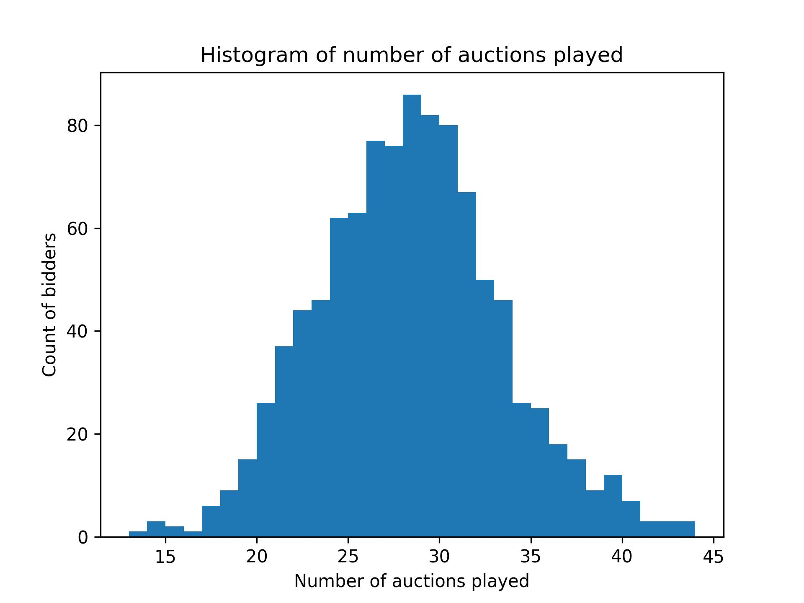

# Second Price Auction: Architecture and Strategy

## Overview
In this project, I create the infrastructure to execute a second price sealed-bid auction and analyze the relative success of different bidding strategies. The infrastucture is implemented via an object oriented paradigm. 

## Motivation
The primary reason for undertaking this project was to practice object oriented programming in Python. However, elements of data analysis and data visualization became pivotal as I moved from infrastructure design to assessment of bidding strategy. This project also contributes to the multi-armed bandit literature, shedding light on how to effectively leverage the explore/exploit approach in a landscape of strategic competition. 

## What is a second price auction? And why build one? 
A second price sealed-bid auction is an auction in which an item is offered for sale to a group of potential buyers (or "bidders"). Each bidder submits a single monetary bid (unseen by the other bidders, hence "sealed"). The item is awarded to the bidder who submits the highest bid, and the price paid for the item is the second highest bid submitted (hence "second price"). 

In my implementation, the item up for auction is the opportunity to show an advertisement to a user (think of a pop-up ad on a web page). The auction therefore involves a set of **users** and a set of **bidders**. The auction proceeds in a series of rounds; in each round, a user is selected at random and each bidder submits their bid for the opportunity to show an ad to this user. The winning bidder pays the second highest bid and earns 1 dollar if the user clicks on their ad (they earn nothing if the user does not click). Each user has an underlying probability of clicking on an ad and this probability remains constant throughout the entire auction and regardless of which bidder shows them an ad. At the beginning of the auction, the bidders have no knowledge of each user's underlying clicking probability. However, the winning bidder in each round is informed as to whether or not the user clicked on their ad. Additionally, all bidders are informed of the winning price at the end of each round. Each bidder begins with a balance of 0 dollars and their singular objective is to finish the auction with as high a balance as possible. (Balances are allowed to become negative). 

## OOP Implementation
In order to create all the functionality necessary to administer such an auction, I created three classes: a `User()` class, a `Bidder()` class, and an `Auction()` class. Objects created from the `User()` class are initialized with a randomly chosen clicking probability. `Bidder()` objects contain the logic necessary to strategically bid in the auction. Lastly, objects created from the `Auction()` class must be initialized with a set of `User()` objects and a set of `Bidder()` objects. `Auction()` objects have the ability to execute rounds of the auction, keeping track of the bidders' balances along the way. 

## Bidding Logic
The central reasoning that should govern a bidder's behavior in this auction is to bid high for users with high clicking probabilities and bid low for users with low clicking probabilities. However, as mentioned above, bidders begin an auction without any knowledge of the users' clicking probabilities; the only way to approximate these probabilities is to repeatedly win auction rounds and observe the clicking tendencies of the users. Such bevavior invariably loses a bidder money in the short term, but serves as an investment into information that can be used to bid more intelligently in later rounds.  

Therefore, bidding can serve two purposes: (1.) to gain information about the users' clicking probabilities and (2.) to make the bidder money. When a bidder pursues the former objective they are said to be "exploring" and when they pursue the latter they are "exploiting". 

The image below depicts an auction with 10 bidders. Bidder7 - represented by the gray line - implements a successful explore/exploit approach. Bidders 3 and 8 unsuccessfully implement such an approach (and bidder9 bids randomly to no avail). The concepts of `alpha` and `agg` in the legend will be explained below. 
  

At least three questions arise for a bidder attempting to leverage an explore/exploit approach to strategic bidding:
1. For how many rounds should I explore before using the information I've gained to exploit?
2. How aggressively should I bid during the exploration stage?
3. How should I use the information gained through exploration to craft the most profitable bids during exploitation? 

The approach that I took to answering these question was to create three numeric variables which take on specific values for a given `Bidder()` object. The variable `alpha` indicates the fraction of the auction for which the bidder will explore; for example, in an auction with $1000$ rounds, an `alpha` value of $0.1$ means that the bidder will explore for $100$ rounds and exploit for $900$ rounds. The `aggressiveness` variable indicates the fixed bid that a bidder will submit during their exploration stage; to continue with the previous example, if this bidder has an `aggressiveness` value of $0.95$, then they will bid \$0.95 for each of the first $100$ rounds. Lastly, to answer the third question, I rely on the assumption that bidding at or near the best estimate of a user's clicking probability is the most effective way to bid during the exploitation stage. The only deviation from this theory was to create a variable called `undercut` which serves to submit bids slightly lower than a given user's estimated clicking probability. For example, if a bidder has an `undercut` value of $0.15$, and - through the information gained during exploration - they estimate that a given user's clicking probability is $0.56$, then they will submit a bid of \$0.41. The task of devising the optimal bidding strategy thus simplifies to finding the values of `alpha`, `aggressiveness`, and `undercut` that maximize a bidder's closing balance. 

It's important to note that this is just one approach to devising bidding logic in a second price sealed-bid auction. More sophisticated approaches abound, but are beyond the scope of what I hoped to gain from this project. For instance, one opportunity that I completely neglect is to incorporate the winning price in each round into bidding logic. While only the winning bidder in a given round can observe the user's clicking behavior, *every* bidder gets to observe the winning price. The reasoning here being that - at least during exploitation - the winning price is likely a good reflection of the given user's clicking probability. This phenomenon sheds light on the fundamentally game theoretical nature of the auction: the suspician that other bidders might incorporate your bids into their estimates of the users' clicking probabilities offers the opportunity to intentionally mislead those bidders. I chose not to engage with this complex opportunity space. 

## Experiment design
I proceeded to evaluate the performance of different combinations of `alpha`, `aggressiveness`, and `undercut` across a variety of auction instances. This is a complex and (potentially) computationally expensive task. The complexity arises from the notion that the performance of one bidder definition is likely dependent on the definition of their competitors as well as the number of users, the users' randomly assigned clicking probabilities, and the number of rounds in a given auction. Even after partitioning the three variables of interest at regular intervals (rather than treating them as continuous) the number of auctions required to test every unique auction state becomes combinatorially explosive. The computational cost of this endeavor would be high. 

Instead of attempting to simulate every possible auction state, I simplified the problem by fixing the number of users per auction at 10, the number of rounds at 1000, and allowing the users' clicking probabilities to be initialilzed randomly (instead of artificially engineering user definitions). As hinted above, I restricted the variables to discrete values as indicated below:  
`alpha` $\in [0, 0.1, ..., 0.8, 0.9]$  
`aggressiveness` $\in [0, 0.05, 0.1, ..., 0.9, 0.95]$  
`undercut` $\in [0, 0.05, 0.1, 0.15, 0.2]$

This results in $1000$ ($10\times20\times5$) unique bidders. 

I then proceeded to run many auctions with different combinations of these bidders. Instead of *systematically* trying specific combinations of bidders within a given auction, I would initialize each auction with anywhere from $5$ to $9$ bidders chosen *randomly* from this set of $1000$. I ran enough auctions that each bidder participated in at least $10$ different auctions (with some participating in as many as $45$) in order to minimize the effect of chance on their performance. 

You can see the full distribution of number of auctions played across the 1000 unique bidders below.  
  

After running $1000$ rounds of an auction, I recorded each bidder's ending balance. For a given bidder, I operationalize their performance by averaging their ending balance across the auctions they participated in; I refer to this variable as `Average Final Balance`. You can see the full distribution of this variable below.
  

About a quarter of the bidders finished with an Average Final Balance of $0 (and about a quarter more were very close to $0); indicating they likely never won a round during their exploration stage and subsequently bid nothing during their exploitation stage. The rest of the distribution is interesting: it appears to be somewhat normal for positive values but extremely spread out for negative values. One interpretation of this phenomenon is that spending money is much easier in this game than earning it, leading to greater potential for highly ineffective bidding than highly effective bidding. 

This brings me to the final discussion: the impact of `alpha`, `aggressiveness`, and `undercut` on `Average Final Balance`. The goal of this analysis was to understand which combinations of these three variabels yield the most effective bidding strategy (and which are most ineffective). I realize now that `alpha` and `aggressiveness` are fundamentally linked in their affect on `Average Final Balance` while the impact of `under_cut` can be considered separately. In fact, `under_cut` appears to be weakly impactful on overall performance: the only discernable relationship is that the highest values of `under_cut` lead to slightly worse outcomes than the smallest values. Therefore, in order to visualize the joint impact of `alpha` and `aggressiveness` on `Average Final Balance`, I present a heatmap colored by performance with the independent variables on the axes. Each square is averaged over the 5 different values of `under_cut` for a given combination of `alpha` and `aggressiveness`. 
  

This heatmap offers many lessons. Most glaringly, combinations of high `alpha` and high `aggressiveness` are extremely ineffective. This is made clear by the darkly colored bottom-right portion of the map. This is a special case of the general observation that high values of `alpha` never yield positive results. This is because if a bidder spends the majority of the auction exploring, they don't leave enough time to recoup their investment through exploitation, especially if that investment was very large (as would result from a high `aggressiveness` value). 

Taking `aggressiveness` by itself for a moment, we can see that low values generally yield final balances of $0. This can be seen by the neutrally colored region at the top of the map. This makes sense, as bidders with low `aggressiveness` will rarely win any rounds during exploration and therefore never bid above $0 during exploitation. 

Finally, the middle to lower-left section of the map points us to the profitable combinations of `alpha` and `aggressiveness`. The lightly colored bottom-left region indicates that the most successful bidders are those who explore very aggressively, but briefly. Such bidders are likely successful because they quickly gain information about the users and then spend most of the auction leveraging that information to earn them money. 

## Conclusions

In this project, I implement a second price sealed-bid auction using an object oriented approach in Python. Furthermore, I design an experiment to understand how to maximize profits as a bidder in such an auction. 

Through this project, I practiced the art of taking a large complex problem and using simplifying assumptions to appropriately re-scope the problem. This project impressed upon me the tendency of the skilled analyst to avoid distracting rabbit holes in order to deliver interpretable, actionable results to decision-makers in a timely manner. 

This analysis suggests that brief and moderately aggressive exploration is the most effective way to bid during a second price sealed-bid auction. 
